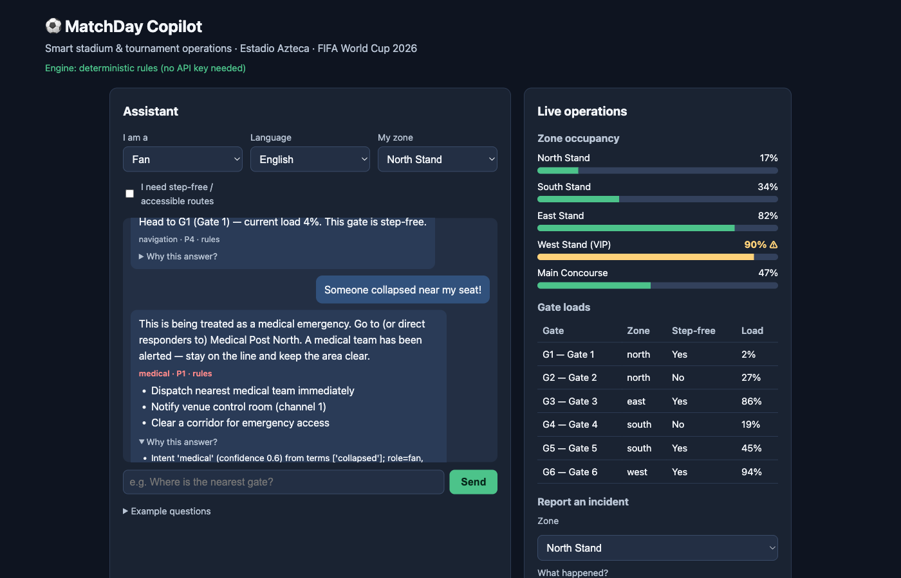

# ⚽ MatchDay Copilot

[](https://github.com/Kai8karma/matchday-copilot-wc26/actions/workflows/ci.yml)

**Live demo:** https://matchday-copilot-theta.vercel.app

**Vertical: Smart Stadiums & Tournament Operations — FIFA World Cup 2026**

A GenAI-powered assistant that optimizes stadium operations and the matchday
experience at Estadio Azteca. One assistant, three personas: **fans** get
context-aware guidance (gates, exits, food, accessibility, venue rules, match
info), while **operations managers and stewards** get live crowd intelligence,
incident triage, and an escalation playbook.

Runs out of the box with **zero API keys** — and upgrades itself when one is
present.



Requires Python 3.10+ (tested on 3.12 and 3.14). No API keys, no database,
no other services.

```
git clone https://github.com/Kai8karma/matchday-copilot-wc26 && cd matchday-copilot-wc26
make install && make run
# Windows / no make:  pip install -r requirements.txt && uvicorn app.main:app
# open http://127.0.0.1:8000
```

## Why this architecture

Most GenAI assistants let the LLM decide *and* speak. In a stadium, a fluent
but wrong answer ("use Gate 4" during a crush at Gate 4) is a safety failure.
MatchDay Copilot splits the two concerns:

```
user message + context (role, zone, language, accessibility)
        │
        ▼
┌─ Intent classifier ─┐   deterministic, multilingual (en/es/fr),
│  app/core/intents   │   safety-critical intents win precedence
└──────────┬──────────┘
           ▼
┌─ Decision engine ───┐   rules over LIVE telemetry (occupancy, gate
│  app/core/engine    │   loads, queues) → decision + reasoning trace
└──────────┬──────────┘
           ▼
┌─ Template NLG ──────┐   grounded draft in the user's language
│  app/core/nlg       │   (fully functional offline)
└──────────┬──────────┘
           ▼
┌─ GenAI polish ──────┐   OPTIONAL: Gemini or Claude rewrites the draft
│  app/llm            │   for fluency — facts locked, injection-fenced,
└──────────┬──────────┘   falls back to draft on any failure
           ▼
   answer + priority + actions + "why this answer?" trace
```

- **Decisions are deterministic and auditable.** Every response carries a
  `reasoning` array listing the rules that fired and the live data used.
- **The LLM only rephrases.** It receives an authoritative draft and may not
  add or alter facts. If it fails, times out, or is unconfigured, the draft
  ships as-is — graceful degradation, never a crash.
- **Context drives logic**, not just tone: accessibility needs hard-filter to
  step-free gates; a fan asking about crowds gets information while an ops
  manager gets an intervention playbook; a packed zone turns an exit query
  into a staggered-egress advisory.

## What it does

| Scenario | Decision logic |
|---|---|
| "Which gate should I use?" | Least-loaded gate from live telemetry, preferring the user's zone; step-free hard filter if accessibility needs are set |
| "Someone collapsed!" | Always **P1**: nearest medical post (zone-adjacency aware), dispatch plan, corridor clearance |
| "I want to leave" | Zone ≥ 90% occupancy → staggered-egress advisory + alternate route (crowd-crush prevention) |
| "¿Dónde puedo comer?" | Shortest concession queue near the user's zone, stadium-wide alternative offered |
| "How's crowd density?" (ops) | Zones over threshold + recommended interventions: open auxiliary gates, redeploy stewards, PA flow guidance |
| "unattended bag by gate 3" | Incident triage matrix → P1–P4 severity + role-appropriate dispatch plan |
| "What's the bag policy?" | Grounded FAQ from the venue knowledge base (no hallucinated policies) |

Live ops dashboard: per-zone occupancy with surge alerts, per-gate loads,
incident log — simulated telemetry that is deterministic per tick, so every
decision path is reproducible in tests.

## Running with GenAI polish (optional)

```
cp env.example .env     # add GEMINI_API_KEY (or ANTHROPIC_API_KEY)
export $(grep -v '^#' .env | xargs) && make run
```

`GET /healthz` reports which mode is active. The UI shows it in the header.

## Testing

```
make test    # 60+ assertions, no network, no keys required
```

Covers: multilingual intent routing, safety-intent precedence, gate selection
under load, accessibility filtering, surge/egress logic, role-based crowd
responses, incident triage matrix, sanitization (XSS/control chars), rate
limiting, security headers, LLM fallback behavior, and full API contract
validation. CI runs the suite on every push (`.github/workflows/ci.yml`).

## Security

- **Input**: all free text sanitized (tag stripping, angle-bracket escaping,
  control chars removed, length caps) and rendered strictly via `textContent`
  in the UI; zones validated against a whitelist on both assist and incident
  endpoints; strict Pydantic validation with enums and bounds everywhere.
- **Prompt injection**: user text is fenced as untrusted data; the system
  prompt forbids following instructions inside it; the LLM cannot change
  facts, only phrasing; oversized/empty LLM outputs are rejected.
- **Transport/headers**: CSP (`self`-only, no inline scripts), nosniff,
  frame-deny, referrer and permissions policies on every response.
- **Abuse**: per-client rate limiting (429) with bounded memory.
- **Secrets**: none in the repo — keys come from the environment only
  (`.env` is gitignored; `env.example` documents the contract).

## Accessibility

- Semantic HTML with landmarks, labels on every control, skip link,
  `aria-live` regions for chat and live data, visible focus indicators.
- Occupancy bars carry text + `aria-label` equivalents (never color-only);
  contrast meets WCAG 2.1 AA; `prefers-reduced-motion` respected.
- Accessibility is also **product logic**: step-free routing, wheelchair
  seating zones, the sensory room, and the assistance desk are first-class
  data the decision engine reasons over.

## Project layout

```
app/
  main.py          FastAPI app: endpoints, rate limit + header middleware
  models.py        Pydantic schemas (roles, intents, priorities, contracts)
  security.py      sanitization, rate limiter, security headers
  llm.py           optional Claude/Gemini adapter with hard fallback
  core/
    intents.py     multilingual keyword classifier (safety-first precedence)
    engine.py      context-aware decision rules + reasoning traces
    nlg.py         en/es/fr templates + grounded FAQ retrieval
  services/
    stadium.py     layout + deterministic simulated telemetry
    schedule.py    fixtures and next-match lookup
    incidents.py   triage matrix, escalation plans, thread-safe log
  data/            stadium layout, fixtures, venue knowledge base
static/            accessible vanilla-JS UI (chat + live ops dashboard)
tests/             pytest suite (offline, deterministic)
docs/              architecture deep-dive + prompt design notes
```

## Assumptions

- One stadium (Estadio Azteca) seeds the demo; layout/fixtures are data files,
  so any venue is a JSON swap away.
- Telemetry is simulated deterministically (sine-wave occupancy per tick) in
  place of turnstile/CV feeds — the decision engine consumes it through the
  same interface a real feed would use.
- Fixtures include a post-tournament Liga MX "legacy operations" event, so
  "next match" answers sensibly on any date — tournament venues keep
  operating after the final, and the ops tooling should too.
- In-memory incident log and rate limiter suit a single-instance demo; the
  classes note their production replacements (queue/DB, Redis).
- The assistant advises; humans decide. P1 flows are designed to alert staff,
  not replace emergency procedure.

## Docs

- [docs/ARCHITECTURE.md](docs/ARCHITECTURE.md) — module-by-module design and data flow
- [docs/PROMPTS.md](docs/PROMPTS.md) — prompt design, grounding, and injection defenses
